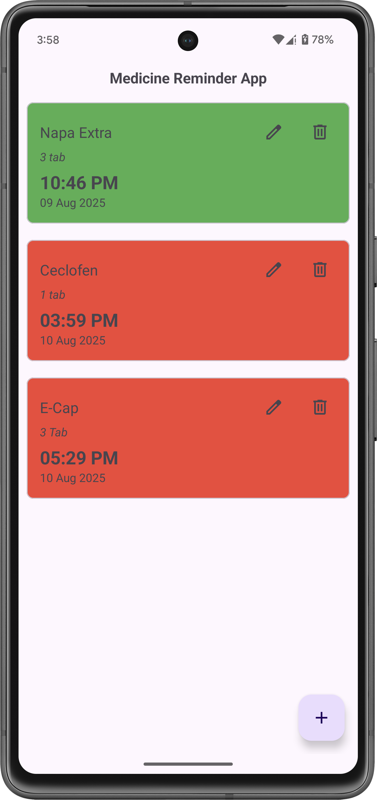
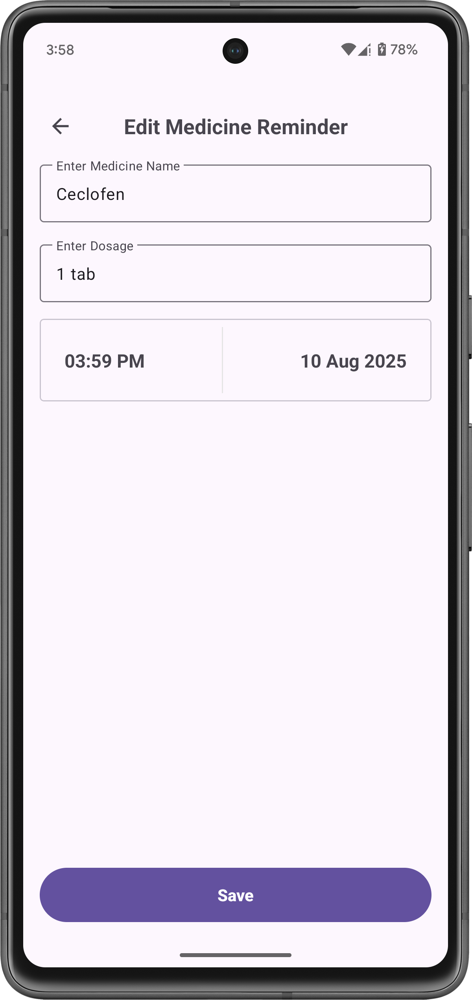
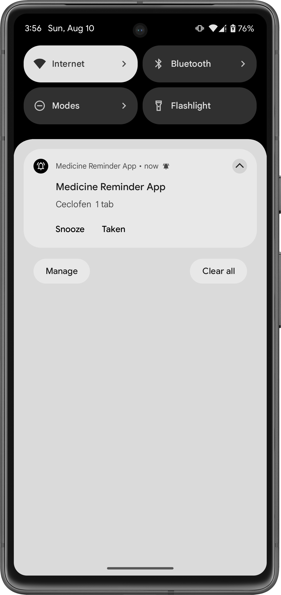

# Medicine Reminder App

A clean, lightweight Android app to help users remember their medicines. Add a medicine, set the dosage and Date/time, get a notification right on schedule, and mark it Taken or Snooze.

---
## 📸 Screenshots

<div align="center">
   &nbsp;&nbsp;&nbsp;
   &nbsp;&nbsp;&nbsp;
  
</div>

---
## ✨ Features

### 💊 Medicine Reminder Management
- ➕ **Add** new reminders with medicine name, dosage, and time  
- ✏️ **Edit** existing reminders anytime  
- 🗑 **Delete** reminders you no longer need  

### 📅 Smart Medicine Schedule
- 📋 **Upcoming Medicine List** — always sorted by the **next due time**  
- ⏱ **Exact-time Notifications** so you never miss a dose  

### 🔔 Interactive Reminders
- ✅ **Mark as Taken** — updates status & stops the alarm instantly  
- ⏳ **Snooze Option** — delay reminder by a set time (e.g., +10 minutes; configurable in `SnoozeConfig`)  

### 💾 Offline & Persistent
- 🗄 **Local Storage** using **Room Database** for data safety  
- ⏰ **Precise Scheduling** with **AlarmManager + BroadcastReceiver** for reliable alerts, even if the app is closed  

---
## Architecture

The app follows MVVM with a clear separation of concerns. The UI layer (Activity/Fragments) observes state exposed by ViewModels as LiveData / Flow, and forwards user intents (add/edit/delete, mark as taken, snooze). ViewModels depend on a Repository that orchestrates between Room (for durable storage) and the Scheduler (AlarmManager wrapper) using Hilt for dependency injection.

Scheduling is centralized: creating/updating a reminder writes to Room and (re)schedules an exact alarm via AlarmManager with unique PendingIntents. A BroadcastReceiver shows a high-priority notification with action buttons. Business rules (duplicate prevention, snooze logic, next occurrence computation) live in the domain layer, keeping UI lightweight and testable.

---

## 🛠 Tech Stack

| Layer                | Technology |
|----------------------|------------|
| **Language**         | Kotlin |
| **Concurrency**      | Coroutines / Flow |
| **Architecture**     | MVVM (ViewModel + LiveData/Flow) |
| **Local Database**   | Room (Entity / DAO / Database) |
| **Dependency Injection** | Hilt |
| **Scheduling**       | AlarmManager + BroadcastReceiver |
| **Notifications**    | NotificationManager / Notification Channels |
| **UI Navigation**    | Fragments + Navigation Component |
| **UI Design**        | Material 3 UI |

---

## 📦 Installation
Clone the repository:
   ```bash
   git clone https://github.com/sabiruzzaman/medicine_reminder_app

```
---
## License

```
Copyright 2025 sabiruzzaman (Md. Sabiruzzaman)

Licensed under the Apache License, Version 2.0 (the "License");
you may not use this file except in compliance with the License.
You may obtain a copy of the License at

    http://www.apache.org/licenses/LICENSE-2.0

Unless required by applicable law or agreed to in writing, software
distributed under the License is distributed on an "AS IS" BASIS,
WITHOUT WARRANTIES OR CONDITIONS OF ANY KIND, either express or implied.
See the License for the specific language governing permissions and
limitations under the License.
```

